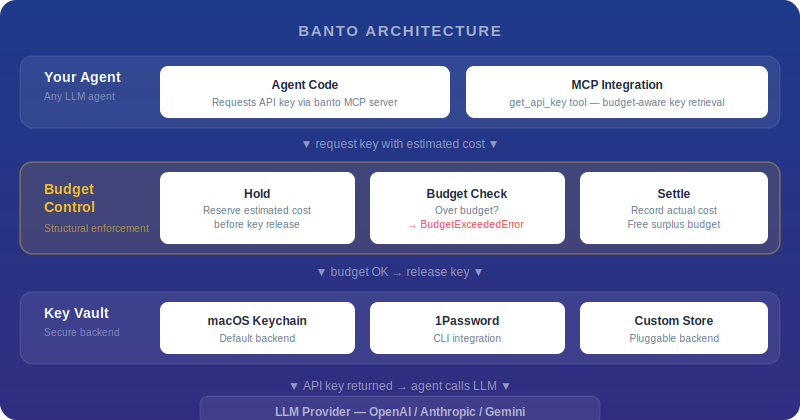
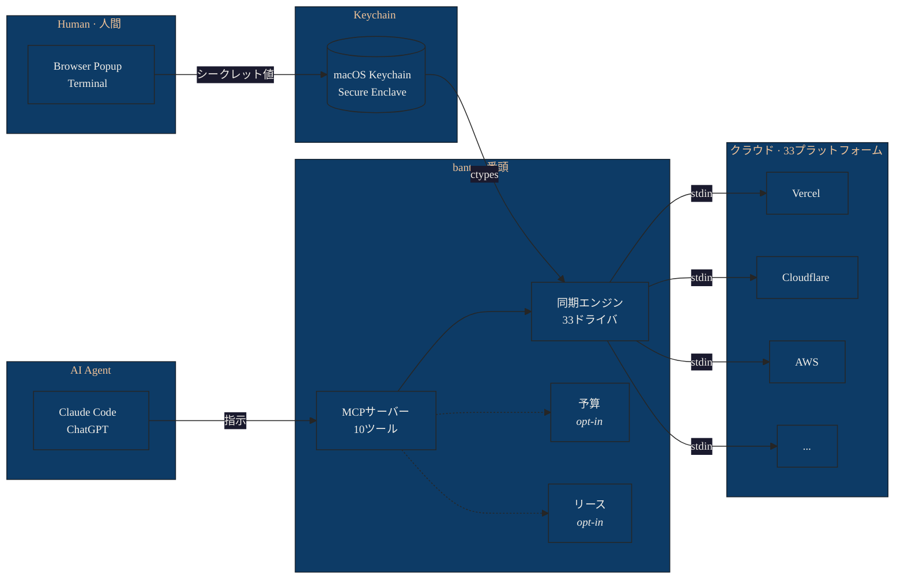

[English](./README.md)

<p align="center">
  
</p>

<h1 align="center">banto</h1>

<p align="center">
  AIエージェントと開発者のための、ローカルファーストなシークレット管理プラットフォーム。
</p>

<p align="center">
  
  
  
  
  
  
  
</p>

> **番頭**（banto） -- 江戸時代の商家において蔵の鍵と帳簿を預かり、主人の留守にも商いの秩序を守った筆頭番頭に由来します。

bantoはmacOS Keychainを基盤とするローカルファーストのシークレット管理プラットフォームです。コア機能はAPIキーをKeychain（ctypes経由、argv露出なし）に格納し、33のクラウドプラットフォームに同期します。オプションモジュールとして、予算ゲーティング（ホールド/精算によるコスト制御）と動的リース（TTL付き短期クレデンシャル）を提供します。MCPサーバーによりClaude CodeやChatGPTと連携し、AIエージェントがシークレット値に一切触れることなくシークレット管理を行えます。

<p align="center">
  
</p>



## 目次

- [🔑 主な機能](#-主な機能)
- [🏮 なぜ banto？](#-なぜ-banto)
- [📋 動作要件](#-動作要件)
- [⚡ クイックスタート](#-クイックスタート)
- [💻 CLIリファレンス](#-cliリファレンス)
- [🤖 MCPサーバー](#-mcpサーバー)
- [🔒 セキュリティ](#-セキュリティ)
- [🐍 Python API](#-python-api)
- [🔌 カスタムバックエンド](#-カスタムバックエンド)
- [⚙️ 設定](#️-設定)
- [❓ よくある質問](#-よくある質問)
- [⚖️ 免責事項](#️-免責事項)
- [📄 ライセンス](#-ライセンス)

## 🔑 主な機能

- **Keychainネイティブストレージ** — macOS Security frameworkへのctypes呼び出し。シークレット値はプロセス引数、一時ファイル、シェル展開のいずれにも現れません
- **APIキー検証** — プッシュ前に6つのプロバイダエンドポイント（OpenAI、Anthropic、Gemini、GitHub、Cloudflare、xAI）に対してキーのヘルスチェックを実行
- **ワンコマンドでプラットフォーム設定** — `banto sync setup vercel:my-project` で環境変数を自動検出し、Keychainエントリとマッチングして一発で設定完了
- **AIエージェント連携** — ClaudeやChatGPTに _「Vercelにシークレットを同期して」_ と指示するだけ。エージェントがオーケストレーションし、人間はブラウザポップアップで値を入力。シークレット値がチャットに入ることはありません
- **MCPサーバー** — Claude Code（stdio）およびChatGPT Connector（トンネル経由のHTTP/SSE）とのネイティブツール連携
- **オプションの予算ゲーティング** — LLMコスト制御のためのホールド/精算パターン。グローバル、プロバイダ別、モデル別の上限設定に対応
- **動的リース** — TTL付きの短期クレデンシャルを取得し、期限切れ時に自動失効
- **Webダッシュボード** — CSRF保護付きのlocalhost限定CRUDインターフェース（`banto sync ui`）
- **フィンガープリントドリフト検出** — SHA-256フィンガープリントでKeychainの変更と最終プッシュを追跡。`banto sync audit` でドリフトを検知
- **全コマンドで `--json` 出力** — エージェントやCI連携のための機械可読出力
- **通知連携** — Slack、Microsoft Teams、Datadog Events、PagerDuty
- **ランタイム依存ゼロ** — 標準ライブラリのみ（ctypesは標準ライブラリの一部）。MCPサーバーにはオプションの `mcp` パッケージが必要

<details>
<summary><strong>33プラットフォーム同期ドライバ</strong> — Cloudflare、Vercel、AWS、GCP、Azure、他28種</summary>

Cloudflare、Vercel、AWS、GCP、Azure、Kubernetes、Docker、Heroku、Fly.io、Netlify、Render、Railway、Supabase、GitLab、GitHub Actions、CircleCI、Bitbucket、Terraform Cloud、Azure DevOps、Deno Deploy、Hasura、Laravel Forge、DigitalOcean、Alibaba、Tencent、Huawei、Naver、NHN、JD Cloud、Sakura、Volcengineなど

</details>

## 🏮 なぜ banto？

他のシークレット管理ツール（Doppler、Infisical、1Password CLI）では、すべてのシークレットを手動で設定する必要があります。bantoならAIエージェントに任せられます:

```
あなた:  「allnew-corporate の Vercel にシークレットを同期して」

エージェント: → banto_sync_setup(platform="vercel", project="allnew-corporate")
               ✓ OPENAI_API_KEY → claude-mcp-openai（マッチ）
               ✓ LINE_CHANNEL_ACCESS_TOKEN → line-clawboy-channel-token（マッチ）
               ✗ POSTGRES_URL（Keychainに未登録 — ブラウザを開きます）
             → banto_register_key(provider="postgres")
               [ブラウザポップアップが開く — 値を入力]
             → banto_sync_push()
               3件のシークレットを Vercel にプッシュしました。

あなた:  完了。
```

**エージェントがオーケストレーション。人間が値を提供。シークレット値がチャットに入ることはありません。**

これが可能なのは、bantoのアーキテクチャが _何をするか_（エージェントが安全に扱えるメタデータ操作）と _実際のシークレット_（Keychainとブラウザポップアップのみ）を分離しているからです。

### ターミナル出力例: `sync setup`

```
$ banto sync setup vercel:allnew-corporate --dry-run

BANTO SYNC SETUP — vercel:allnew-corporate

  (dry run — no changes will be made)

  MATCH  OPENAI_API_KEY -> claude-mcp-openai
  MATCH  ANTHROPIC_API_KEY -> claude-mcp-anthropic
  MATCH  LINE_CHANNEL_ACCESS_TOKEN -> line-clawboy-channel-token
  MISS   POSTGRES_URL (no Keychain match)

  Would register 3 secret(s). Remove --dry-run to apply.
```

### ターミナル出力例: `sync validate`

```
$ banto sync validate --keychain

BANTO SYNC VALIDATE — Testing 8 key(s)

  PASS    claude-mcp-openai: Key valid
  PASS    claude-mcp-anthropic: Key valid
  UNKNOWN claude-mcp-xai: Cannot verify (403)
  PASS    cloudflare-api-token: Token valid
```

## 📋 動作要件

- macOS（シークレット管理にKeychainを使用）
- Python 3.10+
- 外部依存なし（MCPサーバー: `pip install banto[mcp]`）

## ⚡ クイックスタート

### 1. インストール

```bash
# pip
pip install banto

# uv（推奨）
uv tool install banto

# pipx
pipx install banto

# ソースからインストール
git clone https://github.com/allnew-llc/banto.git
cd banto
pip install -e .

# MCPサーバーサポート付き
pip install banto[mcp]
```

### 2. 設定の初期化

```bash
banto init          # ~/.config/banto/config.json と pricing.json を作成
```

### 3. APIキーの登録

```bash
banto register openai    # ブラウザポップアップが開きます — そこでキーを入力
```

ターミナルで入力する場合:

```bash
banto store openai       # マスクされたプロンプトにキーを貼り付け
```

### 4. クラウドプラットフォームへの同期

```bash
banto sync setup vercel:my-project   # 環境変数を自動検出 + Keychainマッチ → 完了
banto sync push                      # 全ターゲットにプッシュ
```

またはAIエージェントに依頼:

> _「Vercel の my-project にシークレットを同期して」_
>
> エージェントが `banto_sync_setup` + `banto_sync_push` を実行。シークレットをチャットに貼り付ける必要はありません。

### 5. （オプション）予算の設定

```bash
banto budget 100                     # グローバル月次上限 $100
banto budget --provider openai 30    # OpenAI $30/月
```

## 💻 CLIリファレンス

<details>
<summary><strong>コアコマンド (9)</strong></summary>

| コマンド | 説明 |
|---------|------|
| `banto status` | 予算状況の表示（プロバイダ別・モデル別の内訳付き） |
| `banto budget [amount]` | 予算上限の表示・設定（グローバル、プロバイダ別、モデル別） |
| `banto profile [name]` | アクティブなモデルプロファイルの表示・設定（quality/balanced/budget） |
| `banto store <provider>` | APIキーをKeychainに登録（ターミナルプロンプト） |
| `banto register [provider]` | ブラウザポップアップを開いてAPIキーを登録 |
| `banto delete <provider>` | APIキーをKeychainから削除 |
| `banto list` | 登録済みキーと予算の一覧 |
| `banto check <model> ...` | コスト見積もりのドライラン（`--tokens`、`--n`、`--seconds`、`--quality`、`--size`） |
| `banto init` | デフォルト設定を `~/.config/banto/` にコピー |

</details>

<details>
<summary><strong>Syncコマンド (13)</strong></summary>

| コマンド | 説明 |
|---------|------|
| `banto sync setup <plat:proj>` | 環境変数を自動検出 + Keychainマッチングでワンコマンド設定（`--dry-run`） |
| `banto sync init` | デフォルトの `sync.json` を作成 |
| `banto sync status` | 同期ステータスマトリクス（シークレット x ターゲット） |
| `banto sync push [name]` | Keychainからターゲットにシークレットをプッシュ（`--validate` でプッシュ前チェック） |
| `banto sync add <name>` | 新規シークレットの追加（`--env`、`--target platform:project`） |
| `banto sync rotate <name>` | シークレットの対話的ローテーション、または `--from-cli '<command>'` で自動化 |
| `banto sync audit` | ドリフト検出: 存在確認、フィンガープリント、ファイル不一致、陳腐化（`--max-age-days N`） |
| `banto sync validate` | プロバイダエンドポイントに対するキー検証（`--keychain`、`--dry-run`） |
| `banto sync history <name>` | フィンガープリント付きのバージョン履歴を表示 |
| `banto sync run [--env E] -- <cmd>` | シークレットを環境変数として注入してコマンドを実行 |
| `banto sync export` | シークレットをenv/json/docker形式でエクスポート（`--format`、`--env`） |
| `banto sync import <file>` | `.env` または `.json` ファイルからシークレットをインポート |
| `banto sync ui [--port N]` | localhost Webダッシュボードを起動（デフォルトポート 8384） |

</details>

<details>
<summary><strong>Leaseコマンド (5)</strong></summary>

| コマンド | 説明 |
|---------|------|
| `banto lease acquire <name>` | 短期クレデンシャルの取得（`--cmd`、`--revoke-cmd`、`--ttl`） |
| `banto lease get <lease_id>` | クレデンシャル値の取得（stdout、パイプ用） |
| `banto lease revoke <lease_id>` | リースの明示的な失効 |
| `banto lease list` | アクティブなリースと残りTTLの一覧 |
| `banto lease cleanup` | 期限切れリースの一括失効 |

</details>

<details>
<summary><strong>ChatGPTコマンド (1)</strong></summary>

| コマンド | 説明 |
|---------|------|
| `banto chatgpt connect` | MCP HTTPサーバー + トンネルを起動し、ChatGPT Connector URLを表示（`--ngrok` または `--cloudflared`） |

</details>

すべてのコマンドで `--json` オプションによる機械可読出力に対応しています。

## 🤖 MCPサーバー

bantoはMCPサーバーを公開し、AIエージェントがシークレット管理を行えるようにします。エージェントがシークレット値を受け取ることはありません — すべてのツールはメタデータのみを返します。

### Claude Code

`.mcp.json` に以下を追加:

```json
{
  "mcpServers": {
    "banto": {
      "command": "banto-mcp",
      "args": []
    }
  }
}
```

オプションのMCP依存パッケージが必要です:

```bash
pip install banto[mcp]
```

### ChatGPT

```bash
banto chatgpt connect
```

MCPサーバーをHTTPモードで起動し、トンネル（ngrokまたはcloudflared）を開いて、ケイパビリティトークン付きのセキュアなConnector URLを表示します。このURLをChatGPTのConnector設定に貼り付けてください。

> **Developer Modeのみ。** bantoはローカルChatGPT Connectorとしての使用を想定しており、公開App Store提出は対象外です（OpenAIの提出ガイドラインはAPIキーの収集を禁止しています）。トンネルURLにはランダムトークンが含まれます — パスワードと同等に扱ってください。MCPリクエスト/レスポンストラフィックはトンネルプロバイダー（ngrokまたはCloudflare）を経由します。シークレット値はレスポンスに含まれませんが、メタデータ（シークレット名、同期状態）はトンネルを通過する場合があります。

### トランスポートモード

```bash
banto-mcp                              # stdio (Claude Code)
banto-mcp --transport sse --port 8385  # SSE (dev)
banto-mcp --transport http --port 8385 # HTTP (production / ChatGPT)
```

### 利用可能なツール

| ツール | 用途 | 備考 |
|--------|------|------|
| `banto_sync_status` | 同期マトリクスの表示（シークレット x ターゲット） | 読み取り専用 |
| `banto_sync_push` | クラウドターゲットへのシークレットプッシュ | クラウド状態を変更 |
| `banto_sync_audit` | ドリフトと陳腐化のチェック | 読み取り専用 |
| `banto_validate` | sync.json内のキー検証 | プロバイダAPIにキーを送信 |
| `banto_validate_keychain` | 全Keychainキーのスキャン + 検証 | プロバイダAPIにキーを送信 |
| `banto_budget_status` | 予算内訳の表示 | 読み取り専用 |
| `banto_register_key` | キー入力用ブラウザポップアップを起動 | 人間が値を入力 |
| `banto_lease_list` | アクティブなリースの一覧 | 読み取り専用 |
| `banto_lease_cleanup` | 期限切れリースの失効 | Keychainを変更 |

すべてのツールにOpenAI互換アノテーション（`readOnlyHint`、`destructiveHint`、`openWorldHint`）が含まれます。

## 🔒 セキュリティ

- **ctypes Keychainアクセス** — `store()` と `get()` はmacOS Security frameworkを直接呼び出します（SecKeychainAddGenericPassword / SecKeychainFindGenericPassword）。subprocess不使用、argv露出なし
- **stdin経由のsyncドライバ** — 33のドライバすべてがstdinパイプ、tempfile（0600）、または `curl -K -` / `-d @file` でシークレットを渡します。シークレット値がプロセス引数に現れることはありません
- **Web UIのCSRF保護** — セッションごとのトークンがすべてのPOSTエンドポイントで必須、Originヘッダー検証、Content-Type強制
- **ChatGPT用ケイパビリティURL** — `banto chatgpt connect` がランダムなパストークンを生成。URLがベアラクレデンシャルとなります
- **フェイルクローズド履歴** — Keychainへの書き込みが失敗した場合、`record()` は `None` を返します。壊れたバージョンのメタデータは保存されません
- **ブラウザ登録ポップアップ** — localhost限定（127.0.0.1）、ランダムポート、使い捨て。値がエコーバックされることはありません
- **検証はopt-in** — `banto sync validate --keychain` には明示的なフラグが必要。`--dry-run` も利用可能
- **リースクレデンシャルの分離** — リース値はKeychainに保持。`lease-state.json` にはメタデータのみ

### 脅威モデル

bantoはbantoのAPIを通じてのみキーにアクセスするエージェントに対して有効です。直接シェルアクセスを持つエージェントはmacOS Keychainに独自に問い合わせることが可能です。多層防御として、エージェントランタイム側でシェルアクセスを制限することを推奨します。

`sync export` と `sync run` は相互運用のため意図的にシークレットを環境変数やstdoutに出力します。エージェントコンテキストではこれらを使用しないでください。

## 🐍 Python API

### 予算ゲーティングあり

```python
from banto import SecureVault, BudgetExceededError, KeyNotFoundError

vault = SecureVault(caller="my_app", budget=True)

try:
    key = vault.get_key(
        model="gpt-4o",
        input_tokens=1000,
        output_tokens=500,
    )
    response = openai.chat.completions.create(
        model="gpt-4o",
        messages=[...],
        api_key=key,
    )
    vault.record_usage(
        model="gpt-4o",
        input_tokens=response.usage.prompt_tokens,
        output_tokens=response.usage.completion_tokens,
        provider="openai",
        operation="chat",
    )
except BudgetExceededError as e:
    print(f"予算超過: 残り${e.remaining:.2f} / 上限${e.limit:.2f}")
except KeyNotFoundError as e:
    print(f"キー未登録: banto store {e.provider}")
```

### 予算なし（キー管理 + 同期のみ）

```python
from banto import SecureVault

vault = SecureVault(caller="my_app", budget=False)
key = vault.get_key(provider="openai")
# キーを直接使用 — コスト追跡なし
```

### 自動検出モード（デフォルト）

```python
vault = SecureVault(caller="my_app")
# budget=None: 設定から自動検出
# monthly_limit_usd > 0 の場合は有効、それ以外は無効
```

### CostGuard（シークレットストレージなしの予算追跡）

```python
from banto import CostGuard

guard = CostGuard(caller="my_mcp")
hold_id = guard.hold_budget(model="dall-e-3", provider="openai",
                            n=1, quality="standard", size="1024x1024")
# ... APIコール ...
guard.settle_hold(hold_id, model="dall-e-3", n=1, provider="openai", operation="image")
```

## 🔌 カスタムバックエンド

シークレットの保管先は `SecretBackend` プロトコルにより差し替え可能です。`get`、`store`、`delete`、`exists`、`list_providers` メソッドを持つ任意のオブジェクトが使用できます。継承は不要です。

### 環境変数

```python
import os
from banto import SecureVault

class EnvVarBackend:
    """BANTO_KEY_<PROVIDER> 環境変数からAPIキーを読み取る。"""

    def get(self, provider: str) -> str | None:
        return os.environ.get(f"BANTO_KEY_{provider.upper()}")

    def store(self, provider: str, api_key: str) -> bool:
        os.environ[f"BANTO_KEY_{provider.upper()}"] = api_key
        return True

    def delete(self, provider: str) -> bool:
        return os.environ.pop(f"BANTO_KEY_{provider.upper()}", None) is not None

    def exists(self, provider: str) -> bool:
        return f"BANTO_KEY_{provider.upper()}" in os.environ

    def list_providers(self, known_providers: list[str]) -> list[str]:
        return [p for p in known_providers if self.exists(p)]

vault = SecureVault(caller="my_app", backend=EnvVarBackend())
```

### 1Password CLI

```python
import json
import subprocess
from banto import SecureVault

class OnePasswordBackend:
    """1Password CLI (op) を使用してAPIキーを取得する。"""

    def __init__(self, vault_name: str = "Private"):
        self.vault_name = vault_name

    def get(self, provider: str) -> str | None:
        try:
            result = subprocess.run(
                ["op", "item", "get", f"banto-{provider}",
                 "--vault", self.vault_name,
                 "--fields", "label=credential", "--format", "json"],
                capture_output=True, text=True,
            )
            if result.returncode == 0:
                return json.loads(result.stdout).get("value")
        except (subprocess.SubprocessError, OSError):
            pass
        return None

    def store(self, provider: str, api_key: str) -> bool: ...
    def delete(self, provider: str) -> bool: ...
    def exists(self, provider: str) -> bool:
        return self.get(provider) is not None
    def list_providers(self, known_providers: list[str]) -> list[str]:
        return [p for p in known_providers if self.exists(p)]

vault = SecureVault(caller="my_app", backend=OnePasswordBackend())
```

### インメモリ（テスト用）

```python
from banto import SecureVault

class InMemoryBackend:
    def __init__(self, keys: dict[str, str] | None = None):
        self._store = dict(keys) if keys else {}

    def get(self, provider: str) -> str | None:
        return self._store.get(provider)
    def store(self, provider: str, api_key: str) -> bool:
        self._store[provider] = api_key
        return True
    def delete(self, provider: str) -> bool:
        return self._store.pop(provider, None) is not None
    def exists(self, provider: str) -> bool:
        return provider in self._store
    def list_providers(self, known_providers: list[str]) -> list[str]:
        return [p for p in known_providers if p in self._store]

vault = SecureVault(
    caller="test",
    backend=InMemoryBackend({"openai": "test-key-12345"}),
)
```

完全な実装例は [examples/06_custom_backend.py](./examples/06_custom_backend.py) を参照してください。

## ⚙️ 設定

すべての設定ファイルは `~/.config/banto/` に配置されます。`banto init` でデフォルトが作成されます。

### `config.json` — 予算とプロバイダ設定

```json
{
  "monthly_limit_usd": 0,
  "providers": {
    "openai": {
      "models": ["gpt-4o", "dall-e-3", "sora-2"]
    },
    "google": {
      "models": ["gemini-3-pro-image-preview", "imagen-4.0-generate-001"]
    }
  }
}
```

予算はUSD建てで、暦月単位で適用されます。デフォルトは `0`（予算無効。コストチェックなしでキーが返されます）。値を設定すると予算ゲーティングが有効になります。

### `pricing.json` — モデル料金テーブル

```json
{
  "gpt-4o": {
    "type": "per_token",
    "input_per_1k": 0.0025,
    "output_per_1k": 0.01
  },
  "dall-e-3": {
    "type": "per_image",
    "variants": {
      "standard_1024x1024": 0.040,
      "hd_1024x1024": 0.080
    },
    "fallback": 0.120
  },
  "sora-2": {
    "type": "per_second",
    "rate": 0.10
  }
}
```

料金は静的です。bantoは実行時にプロバイダAPIから料金を取得しません。各プロバイダの公式料金ページで最新の料金を確認し、`pricing.json` を更新してください。

### `sync.json` — マルチプラットフォーム同期設定

```json
{
  "version": 1,
  "keychain_service": "banto-sync",
  "secrets": {},
  "environments": {
    "dev": {},
    "prd": { "inherits": "dev" }
  }
}
```

`banto sync init` で作成されます。メタデータのみを含み、シークレット値は含まれません。

## ❓ よくある質問

<details>
<summary><strong>予算を超過した場合はどうなりますか？</strong></summary>

`get_key()` が `BudgetExceededError` を発生させ、APIキーは返されません。bantoのAPI経由ではキーを取得する方法がありません。例外には `remaining`（残額）と `limit`（上限）が含まれます。

</details>

<details>
<summary><strong>pricing.json はどのくらいの頻度で更新すべきですか？</strong></summary>

月1回、プロバイダの料金ページを確認してください。bantoは実行時に料金を取得しません（主要プロバイダには公開料金APIがありません）。料金が変更された場合は `~/.config/banto/pricing.json` を編集してください。

</details>

<details>
<summary><strong>record_usage() を呼ぶ前にエージェントがクラッシュした場合は？</strong></summary>

ホールドは予約されたままです。これは設計上の意図です（安全側バイアス）。ホールド額は月がリセットされるか、ホールドがタイムアウト（デフォルト: 24時間、`hold_timeout_hours`）するまで予算に計上され続けます。

</details>

<details>
<summary><strong>エージェントがbantoを迂回してKeychainを直接読めますか？</strong></summary>

はい、直接シェルアクセスがある場合は可能です。bantoは `get_key()` のみを使用するエージェントに対して有効です。多層防御のため、エージェントランタイム側でシェルアクセスを制限することを推奨します。

</details>

<details>
<summary><strong>LinuxやWindowsで使えますか？</strong></summary>

現時点では未対応です。bantoはmacOS Keychain（Security.framework via ctypes）を使用しています。`SecretBackend` プロトコルにより `libsecret`（Linux）や DPAPI（Windows）バックエンドの追加は可能ですが、未実装です。

</details>

<details>
<summary><strong>予算ゲーティングなしで使えますか？</strong></summary>

はい。`SecureVault(budget=False)` でコストチェックなしにキーを直接取得できます。v4.0.0 以降、予算はオプトインです。

</details>

<details>
<summary><strong>パフォーマンスへの影響は？</strong></summary>

無視できるレベルです。bantoは完全にローカルで動作します — ctypes経由のKeychainアクセスはサブミリ秒、予算チェックはローカルJSONファイルの `fcntl` ロック付き読み取り、syncドライバはプラットフォームCLIを直接呼び出します。リモートプロキシ、デーモン、ネットワーク遅延は一切ありません。

</details>

## ⚖️ 免責事項

bantoは予算管理を支援するツールであり、API利用料金の超過を防止することを保証するものではありません。料金テーブルの不正確さ、ソフトウェアの不具合、設定の誤り、bantoのAPIを迂回するエージェントに起因する金銭的損害について、作者は一切の責任を負いません。利用者は、各プロバイダの課金ダッシュボードで実際のAPI利用料金を監視し、料金テーブルを最新の状態に維持する責任を負います。

## 📄 ライセンス

デュアルライセンス:

- **個人利用**（無料）: 個人の方は、個人・教育・研究目的で無償で利用・改変・再配布できます。
- **商用利用**（有料）: 企業・組織での利用には、[AllNew LLC](https://github.com/allnew-llc/banto/issues) との商用ライセンス契約が必要です。

詳細は [LICENSE](./LICENSE) をご参照ください。
