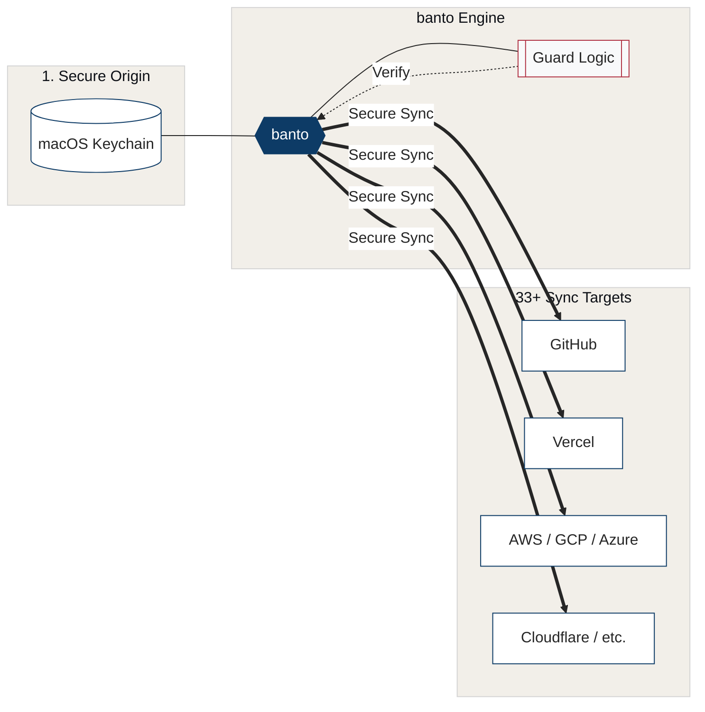

[日本語](./README.ja.md)

<p align="center">
  
</p>

<p align="center">
  One command. 33 platforms. Your secrets, everywhere they need to be.
</p>

<p align="center">
  
  
  
  
  
  
  
</p>

> Named after the **banto** (番頭) — the head clerk of Edo-period Japanese merchant houses who held the keys to the storehouse and managed the account books.

banto syncs your API keys from macOS Keychain to 33 cloud platforms in one command. No more copy-pasting secrets into dashboards. Tell your AI agent _"deploy my secrets to Vercel"_ and it's done — the agent orchestrates, banto syncs, and secret values never enter the chat. Optional budget gating adds intelligent cost control on top.

<p align="center">
  
</p>



## Table of Contents

- [🔑 Key features](#-key-features)
- [🏮 Why banto?](#-why-banto)
- [📋 Requirements](#-requirements)
- [⚡ Quick start](#-quick-start)
- [💻 CLI reference](#-cli-reference)
- [🤖 MCP server](#-mcp-server)
- [🔒 Security](#-security)
- [🐍 Python API](#-python-api)
- [🔌 Custom backends](#-custom-backends)
- [⚙️ Configuration](#️-configuration)
- [❓ FAQ](#-faq)
- [⚖️ Disclaimer](#️-disclaimer)
- [📄 License](#-license)

## 🔑 Key features

- **33+ platform sync** — one command deploys secrets to Vercel, Cloudflare, AWS, GCP, Azure, Kubernetes, GitHub Actions, and 26 more. No dashboard clicking
- **One-command setup** — `banto sync setup vercel:my-project` queries the platform for env var names, matches Keychain entries, and configures sync. Falls back to known env var catalog only with `--guess`
- **AI agent integration** — tell Claude or ChatGPT _"sync my secrets to Vercel"_ and it's done. Agents orchestrate; humans provide values via browser popup. Values never enter the chat
- **Pre-push validation** — health-check keys against 6 provider endpoints (OpenAI, Anthropic, Gemini, GitHub, Cloudflare, xAI) before pushing to catch invalid keys early
- **Drift detection** — SHA-256 fingerprints track Keychain changes vs. last push; `banto sync audit` catches when your deployed secrets are out of date
- **Budget guard** — optional hold/settle pattern for LLM cost control. No budget = no key. Global, per-provider, and per-model limits
- **Dynamic leases** — acquire short-lived credentials with TTL, auto-revoke on expiry
- **MCP server** — native tool integration for Claude Code (stdio) and ChatGPT Connector (HTTP/SSE via tunnel). 10 tools, all metadata-only
- **Keychain-native storage** — macOS Security framework via ctypes; secret values never appear in process arguments
- **Web dashboard** — localhost-only CRUD interface with CSRF protection (`banto sync ui`)
- **Notifications** — Slack, Microsoft Teams, Datadog Events, PagerDuty
- **Zero dependencies** — stdlib only; MCP server requires optional `mcp` package

<details>
<summary><strong>33 platform sync drivers</strong> — Cloudflare, Vercel, AWS, GCP, Azure, and 28 more</summary>

Cloudflare, Vercel, AWS, GCP, Azure, Kubernetes, Docker, Heroku, Fly.io, Netlify, Render, Railway, Supabase, GitLab, GitHub Actions, CircleCI, Bitbucket, Terraform Cloud, Azure DevOps, Deno Deploy, Hasura, Laravel Forge, DigitalOcean, Alibaba, Tencent, Huawei, Naver, NHN, JD Cloud, Sakura, Volcengine, and more

</details>

## 🏮 Why banto?

Most secret managers require you to manually configure every secret in every platform. banto lets your AI agent do it:

```
You:   "Deploy my secrets to my-project on Vercel."

Agent: → banto_sync_setup(platform="vercel", project="my-project")
         ✓ 3 keys matched from Keychain
         ✗ 1 key missing — opening browser for you to enter
       → banto_register_key(provider="database")
         [Browser popup opens — you enter the value]
       → banto_sync_push()
         4 secrets pushed to Vercel.

You:   Done.
```

**The agent orchestrates. The human provides values. Secret values never enter the chat.**

This is possible because banto's architecture separates _what to do_ (agent-safe metadata operations) from _the actual secrets_ (Keychain + browser popup only).

### Terminal output: `sync setup`

```
$ banto sync setup vercel:my-project --dry-run

BANTO SYNC SETUP — vercel:my-project

  (dry run — no changes will be made)

  MATCH  OPENAI_API_KEY -> openai
  MATCH  ANTHROPIC_API_KEY -> anthropic
  MATCH  GITHUB_TOKEN -> claude-mcp-github
  MISS   DATABASE_URL (no Keychain match)

  Would register 3 secret(s). Remove --dry-run to apply.
```

> **Note:** `sync setup` queries the platform CLI (e.g. `vercel env ls --project <name>`) for env var names. If discovery returns nothing (auth issue, wrong project name, or empty project), the command fails closed and suggests re-running with `--guess` to fall back to a known env var catalog.

### Terminal output: `sync validate`

```
$ banto sync validate --keychain

BANTO SYNC VALIDATE — Testing 4 key(s)

  PASS    openai: Key valid
  PASS    anthropic: Key valid
  UNKNOWN xai: Cannot verify (403)
  PASS    github: Token valid
```

## 📋 Requirements

- macOS (uses Keychain for secret storage)
- Python 3.10+
- No external dependencies (MCP server: `pip install banto[mcp]`)

## ⚡ Quick start

### 1. Install

```bash
# pip
pip install banto

# uv (recommended)
uv tool install banto

# pipx
pipx install banto

# From source
git clone https://github.com/allnew-llc/banto.git
cd banto
pip install -e .

# With MCP server support
pip install banto[mcp]
```

### 2. Sync to a platform — one command

```bash
banto sync setup vercel:my-project   # query platform + match Keychain
banto sync push                      # deploy to all targets
```

That's it. banto queries the platform for env var names, matches them to Keychain entries, and pushes.

Or just tell your AI agent:

> _"Sync my secrets to my-project on Vercel."_

### 3. Register keys (if not already in Keychain)

```bash
banto register openai    # opens browser popup — enter your key there
banto store openai       # or paste at masked terminal prompt
```

### 4. Validate before pushing

```bash
banto sync validate --keychain       # test all keys against provider APIs
banto sync push --validate           # validate + push in one step
```

### 5. (Optional) Add budget control

```bash
banto init                           # create budget config
banto budget 100                     # $100/month global limit
banto budget --provider openai 30    # $30/month for OpenAI
```

## 💻 CLI reference

<details>
<summary><strong>Core commands (9)</strong></summary>

| Command | Description |
|---------|-------------|
| `banto status` | Budget status with per-provider/model breakdown |
| `banto budget [amount]` | View or set budget limits (global, provider, model) |
| `banto profile [name]` | Show or set the active model profile (quality/balanced/budget) |
| `banto store <provider>` | Store an API key in Keychain (terminal prompt) |
| `banto register [provider]` | Open browser popup to store an API key |
| `banto delete <provider>` | Delete an API key from Keychain |
| `banto list` | List stored keys and budget summary |
| `banto check <model> ...` | Dry-run budget check (`--tokens`, `--n`, `--seconds`, `--quality`, `--size`) |
| `banto init` | Copy default config to `~/.config/banto/` |

</details>

<details>
<summary><strong>Sync commands (13)</strong></summary>

| Command | Description |
|---------|-------------|
| `banto sync setup <plat:proj>` | Query platform for env vars + match Keychain entries (`--dry-run`, `--guess`) |
| `banto sync init` | Create default `sync.json` config |
| `banto sync status` | Sync status matrix (secrets x targets) |
| `banto sync push [name]` | Push secrets from Keychain to targets (`--validate` for pre-push check) |
| `banto sync add <name>` | Add a new secret (`--env`, `--target platform:project`) |
| `banto sync rotate <name>` | Rotate a secret interactively or via `--from-cli '<command>'` |
| `banto sync audit` | Drift detection: existence, fingerprint, file mismatch, staleness (`--max-age-days N`) |
| `banto sync validate` | Test keys against provider endpoints (`--keychain`, `--dry-run`) |
| `banto sync history <name>` | Show version history with fingerprints |
| `banto sync run [--env E] -- <cmd>` | Run a command with secrets injected as env vars |
| `banto sync export` | Export secrets in env/json/docker format (`--format`, `--env`) |
| `banto sync import <file>` | Import secrets from `.env` or `.json` file |
| `banto sync ui [--port N]` | Launch localhost web dashboard (default port 8384) |

</details>

<details>
<summary><strong>Lease commands (5)</strong></summary>

| Command | Description |
|---------|-------------|
| `banto lease acquire <name>` | Acquire a short-lived credential (`--cmd`, `--revoke-cmd`, `--ttl`) |
| `banto lease get <lease_id>` | Retrieve credential value (stdout, for piping) |
| `banto lease revoke <lease_id>` | Explicitly revoke a lease |
| `banto lease list` | Show active leases with remaining TTL |
| `banto lease cleanup` | Revoke all expired leases |

</details>

<details>
<summary><strong>ChatGPT command (1)</strong></summary>

| Command | Description |
|---------|-------------|
| `banto chatgpt connect` | Start MCP HTTP server + tunnel, print ChatGPT Connector URL (`--ngrok` or `--cloudflared`) |

</details>

All commands support `--json` for machine-readable output.

## 🤖 MCP server

banto exposes an MCP server so AI agents can orchestrate secret management. Agents never receive secret values — all tools return metadata only.

### Claude Code

Add to your `.mcp.json`:

```json
{
  "mcpServers": {
    "banto": {
      "command": "banto-mcp",
      "args": []
    }
  }
}
```

Requires the optional MCP dependency:

```bash
pip install banto[mcp]
```

### ChatGPT

```bash
banto chatgpt connect
```

This starts the MCP server in HTTP mode, opens a tunnel (ngrok or cloudflared), and prints a secure Connector URL with a capability token. Paste the URL into ChatGPT's Connector settings.

> **Developer Mode only.** banto is designed for use as a local ChatGPT Connector, not for public App Store submission (OpenAI's submission guidelines prohibit collecting API keys). The tunnel URL contains a random token — treat it like a password. MCP request/response traffic is proxied through the tunnel provider (ngrok or Cloudflare); secret values are never included in responses, but metadata (secret names, sync status) may transit.

### Transport modes

```bash
banto-mcp                              # stdio (Claude Code)
banto-mcp --transport sse --port 8385  # SSE (dev)
banto-mcp --transport http --port 8385 # HTTP (production / ChatGPT)
```

### Available tools

| Tool | Purpose | Notes |
|------|---------|-------|
| `banto_sync_status` | Show sync matrix (secrets x targets) | Read-only |
| `banto_sync_push` | Push secrets to cloud targets | Modifies cloud state |
| `banto_sync_audit` | Check drift and staleness | Read-only |
| `banto_validate` | Validate keys in sync.json | Sends keys to provider APIs |
| `banto_validate_keychain` | Scan + validate all Keychain keys | Sends keys to provider APIs |
| `banto_budget_status` | Budget breakdown | Read-only |
| `banto_register_key` | Open browser popup for key entry | Human enters value |
| `banto_lease_list` | List active leases | Read-only |
| `banto_lease_cleanup` | Revoke expired leases | Modifies Keychain |

All tools include OpenAI-compatible annotations (`readOnlyHint`, `destructiveHint`, `openWorldHint`).

## 🔒 Security

- **ctypes Keychain access** — `store()` and `get()` call macOS Security framework directly (SecKeychainAddGenericPassword / SecKeychainFindGenericPassword). No subprocess, no argv exposure
- **stdin-based sync drivers** — all 33 drivers pass secrets via stdin pipe, tempfile (0600), or `curl -K -` / `-d @file`. Secret values never appear in process arguments
- **CSRF protection on web UI** — per-session token required on all POST endpoints, Origin header validation, Content-Type enforcement
- **Capability URLs for ChatGPT** — `banto chatgpt connect` generates a random path token; the URL is the bearer credential
- **Fail-closed history** — `record()` returns `None` if Keychain write fails; no metadata saved for broken versions
- **Browser registration popup** — localhost-only (127.0.0.1), random port, single-use; value never echoed back
- **Validate is opt-in** — `banto sync validate --keychain` requires explicit flag; `--dry-run` available
- **Lease credential isolation** — lease values stay in Keychain; `lease-state.json` contains only metadata

### Threat model

banto protects secrets from exposure through process arguments and standard logging. It does **not** protect against:

- **Agents with unrestricted shell access** — they can query macOS Keychain directly via `security` CLI
- **Kernel-level inspection** — OS audit subsystems or filesystem-level access can observe tempfiles before deletion
- **Tunnel provider visibility** — `banto chatgpt connect` routes metadata (secret names, sync status) through ngrok or Cloudflare

For defense-in-depth: restrict shell access in your agent runtime, and consider OS-level access controls for sensitive environments.

`sync export` and `sync run` intentionally materialize secrets into environment variables or stdout for interoperability. Do not use these in agent contexts.

## 🐍 Python API

### With budget gating

```python
from banto import SecureVault, BudgetExceededError, KeyNotFoundError

vault = SecureVault(caller="my_app", budget=True)

try:
    key = vault.get_key(
        model="gpt-4o",
        input_tokens=1000,
        output_tokens=500,
    )
    response = openai.chat.completions.create(
        model="gpt-4o",
        messages=[...],
        api_key=key,
    )
    vault.record_usage(
        model="gpt-4o",
        input_tokens=response.usage.prompt_tokens,
        output_tokens=response.usage.completion_tokens,
        provider="openai",
        operation="chat",
    )
except BudgetExceededError as e:
    print(f"Over budget: ${e.remaining:.2f} remaining of ${e.limit:.2f}")
except KeyNotFoundError as e:
    print(f"No key for {e.provider}. Run: banto store {e.provider}")
```

### Without budget (key storage + sync only)

```python
from banto import SecureVault

vault = SecureVault(caller="my_app", budget=False)
key = vault.get_key(provider="openai")
# Use key directly — no cost tracking
```

### Auto-detect mode (default)

```python
vault = SecureVault(caller="my_app")
# budget=None: auto-detects from config
# Enabled when monthly_limit_usd > 0, disabled otherwise
```

### CostGuard (budget tracking without secret storage)

```python
from banto import CostGuard

guard = CostGuard(caller="my_mcp")
hold_id = guard.hold_budget(model="dall-e-3", provider="openai",
                            n=1, quality="standard", size="1024x1024")
# ... call API ...
guard.settle_hold(hold_id, model="dall-e-3", n=1, provider="openai", operation="image")
```

## 🔌 Custom backends

The secret storage is pluggable via the `SecretBackend` protocol. Any object with `get`, `store`, `delete`, `exists`, and `list_providers` methods works. No inheritance required.

### Environment variables

```python
import os
from banto import SecureVault

class EnvVarBackend:
    """Read API keys from BANTO_KEY_<PROVIDER> environment variables."""

    def get(self, provider: str) -> str | None:
        return os.environ.get(f"BANTO_KEY_{provider.upper()}")

    def store(self, provider: str, api_key: str) -> bool:
        os.environ[f"BANTO_KEY_{provider.upper()}"] = api_key
        return True

    def delete(self, provider: str) -> bool:
        return os.environ.pop(f"BANTO_KEY_{provider.upper()}", None) is not None

    def exists(self, provider: str) -> bool:
        return f"BANTO_KEY_{provider.upper()}" in os.environ

    def list_providers(self, known_providers: list[str]) -> list[str]:
        return [p for p in known_providers if self.exists(p)]

vault = SecureVault(caller="my_app", backend=EnvVarBackend())
```

### 1Password CLI

```python
import json
import subprocess
from banto import SecureVault

class OnePasswordBackend:
    """Retrieve API keys from 1Password using the `op` CLI."""

    def __init__(self, vault_name: str = "Private"):
        self.vault_name = vault_name

    def get(self, provider: str) -> str | None:
        try:
            result = subprocess.run(
                ["op", "item", "get", f"banto-{provider}",
                 "--vault", self.vault_name,
                 "--fields", "label=credential", "--format", "json"],
                capture_output=True, text=True,
            )
            if result.returncode == 0:
                return json.loads(result.stdout).get("value")
        except (subprocess.SubprocessError, OSError):
            pass
        return None

    def store(self, provider: str, api_key: str) -> bool: ...
    def delete(self, provider: str) -> bool: ...
    def exists(self, provider: str) -> bool:
        return self.get(provider) is not None
    def list_providers(self, known_providers: list[str]) -> list[str]:
        return [p for p in known_providers if self.exists(p)]

vault = SecureVault(caller="my_app", backend=OnePasswordBackend())
```

### In-memory (for testing)

```python
from banto import SecureVault

class InMemoryBackend:
    def __init__(self, keys: dict[str, str] | None = None):
        self._store = dict(keys) if keys else {}

    def get(self, provider: str) -> str | None:
        return self._store.get(provider)
    def store(self, provider: str, api_key: str) -> bool:
        self._store[provider] = api_key
        return True
    def delete(self, provider: str) -> bool:
        return self._store.pop(provider, None) is not None
    def exists(self, provider: str) -> bool:
        return provider in self._store
    def list_providers(self, known_providers: list[str]) -> list[str]:
        return [p for p in known_providers if p in self._store]

vault = SecureVault(
    caller="test",
    backend=InMemoryBackend({"openai": "test-key-12345"}),
)
```

See [examples/06_custom_backend.py](./examples/06_custom_backend.py) for complete implementations.

## ⚙️ Configuration

All config files live in `~/.config/banto/`. Run `banto init` to create defaults.

### `config.json` — Budget and provider settings

```json
{
  "monthly_limit_usd": 0,
  "providers": {
    "openai": {
      "models": ["gpt-4o", "dall-e-3", "sora-2"]
    },
    "google": {
      "models": ["gemini-3-pro-image-preview", "imagen-4.0-generate-001"]
    }
  }
}
```

Budget is in USD, enforced per calendar month. Default is `0` (budget disabled; keys returned without cost checks). Set a value to enable budget gating.

### `pricing.json` — Model pricing table

```json
{
  "gpt-4o": {
    "type": "per_token",
    "input_per_1k": 0.0025,
    "output_per_1k": 0.01
  },
  "dall-e-3": {
    "type": "per_image",
    "variants": {
      "standard_1024x1024": 0.040,
      "hd_1024x1024": 0.080
    },
    "fallback": 0.120
  },
  "sora-2": {
    "type": "per_second",
    "rate": 0.10
  }
}
```

Prices are static. banto does not fetch pricing from provider APIs at runtime. Verify rates at each provider's official pricing page and update `pricing.json` accordingly.

### `sync.json` — Multi-platform sync config

```json
{
  "version": 1,
  "keychain_service": "my-vault",
  "secrets": {},
  "environments": {
    "dev": {},
    "prd": { "inherits": "dev" }
  }
}
```

Created by `banto sync init`. Contains metadata only — no secret values.

## ❓ FAQ

<details>
<summary><strong>What happens when the budget is exceeded?</strong></summary>

`get_key()` raises `BudgetExceededError` and the API key is not returned. The agent has no code path to obtain the key through banto's API. The exception includes `remaining` and `limit` amounts for error messages.

</details>

<details>
<summary><strong>How often should I update pricing.json?</strong></summary>

Check provider pricing pages monthly. banto does not fetch pricing at runtime — no major provider offers a public pricing API. When a provider changes rates, edit `~/.config/banto/pricing.json`. Incorrect rates mean inaccurate budget estimates, not security issues.

</details>

<details>
<summary><strong>What if my agent crashes before calling record_usage()?</strong></summary>

The hold stays reserved. This is by design (safe-side bias). The held amount continues to count against your budget until the month resets or the hold times out (default: 24 hours via `hold_timeout_hours`).

</details>

<details>
<summary><strong>Can an agent bypass banto and read Keychain directly?</strong></summary>

Yes, if the agent has direct shell access. banto protects against agents that use only `get_key()`. For defense-in-depth, restrict shell access in your agent runtime. See the [Security](#-security) section.

</details>

<details>
<summary><strong>Does banto work on Linux or Windows?</strong></summary>

Not yet. banto uses macOS Keychain (Security.framework via ctypes). The `SecretBackend` protocol allows pluggable backends — a `libsecret` (Linux) or DPAPI (Windows) backend is possible but not implemented.

</details>

<details>
<summary><strong>Can I use banto without budget gating?</strong></summary>

Yes. `SecureVault(budget=False)` returns keys directly without cost checks. Budget is opt-in since v4.0.0.

</details>

<details>
<summary><strong>What's the performance overhead?</strong></summary>

Negligible. banto runs entirely locally — Keychain access via ctypes is sub-millisecond, budget checks read a local JSON file with `fcntl` locking, and sync drivers call platform CLIs directly. There is no remote proxy, no daemon, and no network latency added to key retrieval.

</details>

## ⚖️ Disclaimer

banto is a budget management aid, not a guarantee against excessive API charges. The authors shall not be liable for any financial losses arising from inaccurate pricing tables, software defects, configuration errors, or agents that bypass banto's API. Users are solely responsible for monitoring actual API spend through each provider's billing dashboard and for keeping the pricing table up to date.

## 📄 License

Dual license:

- **Personal use** (free): Individuals may use, modify, and redistribute banto at no cost for personal, educational, and research purposes.
- **Commercial use** (paid): Organizations and companies require a commercial license from [AllNew LLC](https://github.com/allnew-llc/banto/issues).

See [LICENSE](./LICENSE) for full terms.
